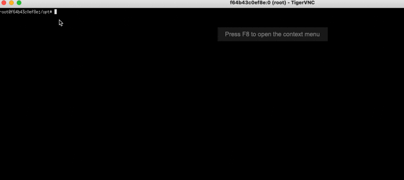

# The FLEDGE Lab

---

The goal of this project is to provide an easy and friendly way to gain a practical understanding of the [FLEDGE](https://github.com/WICG/turtledove/blob/main/FLEDGE.md) API and its implementation.

Feel free to contribute if you have any ideas or ask if you want to use it but don't know how to get started.

## Description

The project is made up of 6 containers managed with `docker compose`:

- **advertiser**: serves pages used to join interest groups to the browser.
- **publisher**: serves pages used to trigger auctions and show the winning ad in the browser.
- **ssp**: serves the auction logic.
- **dsp**: serves the interest groups and the bidding logic. This container has a total of 64 extra aliases in the network so you can simulate having 256 DSPs/buyers if necessary without having to duplicate all the code and resources.
- **client**: operates a browser that interacts with the other containers, both manually using a remote VNC session or automated with [selenium](https://www.selenium.dev/documentation/webdriver/) and python scripts.

There is an additional container, **cert_creator**, whose only purpose is to create the TLS certificates and the Certificate Authority (CA) for the other containers.

## Getting Started

### Installing

1. Clone this repo.
2. Run `make create-certs` to build all the necessary TLS certificates and the corresponding CA and distribute them to the different containers. This is necessary because FLEDGE strictly enforces HTTPS for every participant and _self-signed_ certs will not work. This only needs to be done once.

### Selecting Chromium Version

The `docker-compose.yml` file has a `CHROMIUM_REVISION` argument for the **client** container. You can change this number to automatically have that specific revision of Chromium downloaded and installed along with its corresponding driver that allows _selenium_ to control the browser. (NOTE: For ARM architectures, fledge_lab currently only supports the latest stable version of Chromium)

The **revision number is not the same as version** and it is not that simple to get a version mapping. However, one nice trick is to visit this [link](https://www.googleapis.com/download/storage/v1/b/chromium-browser-snapshots/o/Linux_x64%2FLAST_CHANGE?alt=media) to download a text file containing the latest available revision number.

If you want to see the date a specific revision was released, you can visit the following URL (replace 953180 with your revision):
`https://commondatastorage.googleapis.com/chromium-browser-snapshots/index.html?prefix=Linux_x64/953180/`

Once you have a Chromium browser installed, you can get its version in at least 3 different ways:

1. Running `chrome --version` in the terminal.
2. Running `navigator.appVersion` in the browser's JS console.
3. Adding `logging.info(f"Chromium version: {browser.capabilities['browserVersion']}")` to your selenium script where `browser` is the _selenium_ driver instance. This will add the version to the script's log file.

### Running

Run `make build && make run` will build and launch all the necessary containers. You may end up using `make clean-output && make build && make run` often.

You can then connect to the Chromium browser in the **client** with `make connect`.

### Selenium Scripts

You can run all the Selenium scripts with `make test`.

#### Manually Run Selenium Scripts

To manually launch a selenium script, first enter the **client** container with `make enter-client`. Then `cd` to `scripts` and run `python my_selenium_script.py` where the script is one of those available in [client/scripts/](client/scripts/).

### Demo

The demo below shows a simple example of a dummy shoe store where:

1. We visit a publisher (dummy news site) before joining any interest groups => auction results in no ad.
2. We visit the home page of the shoe store => join IG that bids 1.
3. We visit the publisher again => the previously joined IG (bid=1) wins and its ad shows.
4. We visit a product of the store (shoe A) => join IG that bids 100.
5. We visit the publisher again => the previously joined IGs (bid=1,bid=100) battle it out in the auction and shoe A (bid=100) wins and its ad shows.
6. We visit a product of the store (shoe B) => join IG that bids 100 (it's a nice shoe!).
7. We visit the publisher again => the previously joined IGs (bid=1,bid=100,bid=150) go at it and shoe B (bid=150) wins and its ad shows.



#### Automated Run

See the script [client/scripts/auction.py](client/scripts/auction.py) to see how the manual example above could be automated. The same manual steps you saw above roughly translate into the following:

```python
URLS_IMAGES = [
    (None, 'publisher_before_join.png'),
    ('https://advertiser', 'publisher_after_general_join.png'),
    ('https://advertiser/shoe-a', 'publisher_after_shoe_a_join.png'),
    ('https://advertiser/shoe-b', 'publisher_after_shoe_b_join.png'),
]

for url_advertiser, image_name in URLS_IMAGES:
    if url_advertiser:
        browser.get(url_advertiser)  # join the IG
    browser.get('https://publisher/')  # trigger auction & show winning ad
    time.sleep(0.5)  # wait a little to make sure we screenshot after completion
    browser.save_screenshot(os.path.join(output_path, image_name))
```

This includes taking a screenshot of every page we saw in the manual example as well. Please note the `time.sleep` used after visiting the publisher (i.e. after triggering the auction). This in order to make sure that the auction was able to complete and the page was able to render the ad. Under some circumstances involving heavy load you may need to increase the delay if you want to capture a screenshot of the result.

Screenshots are one possible way of extracting auction results, not necessarily the best one. [Event-level reporting](https://github.com/WICG/turtledove/blob/main/FLEDGE.md#5-event-level-reporting-for-now) would certainly be a viable option and definitely more timely to measure auction timing. However, it is only a temporary mechanism. It could be interesting to use it and compare the results with the screenshot method.

### Selenium Scripts

#### _auction_

This script runs the _shoe store_ auction from the examples above. The goal was to simulate a very simple setting where we could have an auction complete successfully.

#### _dynamic_auction_

After looking into the _shoe store_ auction example you may have noticed that scaling such an example would be quite cumbersome as we would have to create new HTML pages and so on. The goal were was to explore a way of bypassing that restriction so we could easily scale to _N_ interest groups. Dynamism is introduced by making use of [url parameters](https://en.wikipedia.org/wiki/Query_string) for certain parameters. We see for example that the interest group name as well as the bid are dynamic.

The script itself joins 3 dynamic IGs and, if everything worked correctly, then the one with the highest bid would win.

To join a dynamically-created IG you just have to visit `https://advertiser/dynamic`, so for example if you wanted to join an IG with _name=ig-dynamic_ and _bid=42_ you would visit:

`https://advertiser/dynamic?name=ig-dynamic&bid=42`

The ultimate purpose of this script is just to test that we can use dynamic parameters so it is easier to build other scripts/tests.

#### _dynamic_auction_multi_dsp_

This is the same as _dynamic_auction_ but with a small change: it uses a dynamic parameter to test that we can do auctions with multiple DSPs participating. It does so by passing the _dsp_ domain as a URL parameter. For example:

`https://advertiser/dynamic?name=ig-dynamic&bid=42&dsp2`

#### _wasm_outside_worklet_

This just visits a page that imports `bidding_logic_wasm.js` and calls the WASM functions in a normal web page (no worklets involved) to validate that the functions are imported correctly and run as expected. This is mostly for debugging purposes as worklets introduce additional complexity. It runs the `generateBid` function outside of the worklet and outside of any auction.

#### _dynamic_wasm_auction_

This is the same as _dynamic_auction_ but with one twist: the interest group with the highest bid uses WebAssembly in its bidding logic. If that interest group wins then we know WebAssembly works.

WebAssembly in the worklets just landed on 2021-12-22 and some adjustments will be necessary in the bidding function to make this work.

As a side note, this script also uses dynamic IG with an added parameter, the bidding function filename itself by using:

`https://advertiser/dynamic?name=ig-3&bid=3&biddingLogicName=bidding_logic_wasm`

This will ask the interest group to use `https://dsp/bidding_logic_wasm.js` (actually found in `dsp/public/bidding_logic_wasm.js`). This feature could be useful as so far the two bidding functions are extremely simple (i.e. bid what was given by the _bid_ url parameter) to allow for easy testing of passing a parameter (_bid_ in this case) but we will obviously want to make use of more complicated bidding functions that incorporate models and this could be a way to do it.

WASM started working around January 19th, 2022 (99.0.4812.0).

#### _find_interest_group_size_

This finds how much data we can use in the interest group (TL;DR: 50kb for initial join, 10kb in daily updates as at 2021-12-22). It does so exploiting the fact that while interest group joining is silent (i.e. will return _undefined_ regardless of what happens) the only way an auction will return an ad is if it has an interest group. Using this we can calibrate the size of the joined interest group until it finds the maximum size.

Real-time feedback on whether the auction worked or not is retrieved via [OCR](https://en.wikipedia.org/wiki/Optical_character_recognition). Maybe there is an easier way of doing this with reporting for example (yet to be explored) but OCR turned out to be a pretty easy way of doing this for now.

#### _test_interest_group_amount_

This tries to find how many interest groups we can join but in doing so it also explores timeout dynamics and the consistency of auctions.

```bash
python test_interest_group_amount.py --n-IGs 1500 --n-samples-before-maintenance 250 --n-samples-after-maintenance 250
```

#### _test_interest_group_bidding_order_

This extends _test_interest_group_amount_ by exploiting the fact that, due to timeouts, the very first IG joined never wins even though it has the highest bid. We update it at the very end so it is more recent in the queue of IGs and then it wins every single time. This was to prove the LIFO nature of bidding in the current implementation (last one to join is the first one to bid).

#### _denial_of_service_

This script attempts to test the limits of the auction system to see what we can learn. A bidding function with an infinite loop is injected into the mix, to varying degrees (as a share of bidders) to see how the auction and system handle this stress. In a way, it is an attempt to cause a denial of service by overwhelming the system. The main goal is to observe how/if one bidder can affect others.


```bash
python denial_of_service.py --n-total 200 --n-samples 200 --n-dsp 64
python denial_of_service.py --n-total 200 --n-samples 200 --n-dsp 32
python denial_of_service.py --n-total 200 --n-samples 200 --n-dsp 16
python denial_of_service.py --n-total 200 --n-samples 200 --n-dsp 8
python denial_of_service.py --n-total 200 --n-samples 200 --n-dsp 4
python denial_of_service.py --n-total 200 --n-samples 200 --n-dsp 2
python denial_of_service.py --n-total 200 --n-samples 200 --n-dsp 1

python denial_of_service.py --n-total 2 --n-samples 200 --n-dsp 2
python denial_of_service.py --n-total 4 --n-samples 200 --n-dsp 4
python denial_of_service.py --n-total 8 --n-samples 200 --n-dsp 8
python denial_of_service.py --n-total 16 --n-samples 200 --n-dsp 16
python denial_of_service.py --n-total 32 --n-samples 200 --n-dsp 32
python denial_of_service.py --n-total 64 --n-samples 200 --n-dsp 64
python denial_of_service.py --n-total 128 --n-samples 200 --n-dsp 128
python denial_of_service.py --n-total 256 --n-samples 200 --n-dsp 256
```

#### _arapi_click_

This script tests that the Attribution Reporting API (ARAPI, previously known as Conversion Measurement API or CMAPI) works. It does so by visiting an ARAPI-enabled ad, clicking on it and taking a screenshot of the browser's conversion internals.

#### _arapi_conversion_

This script tests ARAPI conversions. It does so by visiting an ARAPI-enabled ad, clicking on it and and then going forward with two actions: _add-to-cart_ and _checkout_. Finally, it forces the browser to send the reports to the DSP, which are then saved under _output/arapi_reports_dir_. It provides with a simple minimal example of ARAPI usage. For now, it only supports event-level reporting.

TODO: add aggregate-level reporting (must check first if it is available)

### Logging

Every script uses or at least should use logging. The standard Python logger is used without too many bells and whistles. If the pattern of the current scripts is used, the outputs will be saved to `output/my_script_name/` via a docker volume. Browser screenshots are also used as a way of logging behavior.

Run `make clear-output` to remove all logs from a previous run.

## BYOE (Bring Your Own Experiment)

### How Do I Start?

The simplest way is probably making a copy of [client/scripts/auction.py](client/scripts/auction.py) and adapting it for your own purposes and then adding `python new_script.py` to [client/tests.sh](client/tests.sh).

### How Do I Join an Interest Group?

If you want to join an IG for your own experiment, use the dynamic method by making the browser visit:

`https://advertiser/dynamic?name=my-ig-name&bid=42&bidbiddingLogicName=myBiddingLogic.js`

If you wish to make more parameters dynamic, edit [this file](dsp/public/dynamic-interest-group.html). The file also gives a good look into the FLEDGE API for _joinAdInterestGroup_.

### How Do I Use My Own Bidding Logic/Model?

When you join an IG, make sure to point it to the right `biddingLogicUrl`. If you are using the dynamic IG method this is as simple as putting your bidding logic JS file in `dsp/public/myBiddingLogic.js` and passing `biddingLogicName=myBiddingLogic` in the url parameters.

### But How Do I Create My Own Bidding Logic?

See [this section](https://github.com/WICG/turtledove/blob/main/FLEDGE.md#32-on-device-bidding) from the proposal. Essentially, you must create a _generateBid(...)_ function that returns 4 elements (3 if you don't use _adComponents_), among them, the _bid_. As per the proposal, you can use various pieces of data inside generate bid. In our basic function, for example, we use _userBiddingSignals_ with a key-value pair we defined ourselves (i.e. _bid_) to bid:

```JavaScript
function generateBid(interestGroup, auctionSignals, perBuyerSignals, trustedBiddingSignals, browserSignals) {
    const igBid = interestGroup['userBiddingSignals']['bid'];
    // bid whatever was passed via userBiddingSignals, if nothing was passed just bid 1
    const bid = isNaN(igBid) ? 1 : igBid;

    return {
        ad: "ad-metadata",
        bid: bid,
        render: interestGroup.ads[0].renderUrl
    }
}
```

You _could_ pass this data to your own WebAssembly function and have it return your bid which you would then return with this function.

### How Do I Use WASM (WebAssembly) In My Bidding Logic/Model?

This is preliminary work but see [dsp/public/bidding_logic_wasm.js](dsp/public/bidding_logic_wasm.js) and [dsp/bidding-logic-wasm/](dsp/bidding-logic-wasm/), particularly [lib.rs](dsp/bidding-logic-wasm/src/lib.rs). Rust + [wasm-pack](https://github.com/rustwasm/wasm-pack) make it easy to build your _wasm_ file from your Rust code.

Getting the _wasm_ into your JS is a little more complicated. The current workflow embeds it into the file as an array of integers representing bytes and is then parsed. It could be fetched from somewhere else. Ideally it would be fetched from a cache in the browser. These things are evolving quickly.

### How Do I Run an Auction?

You can learn more by looking at the [relevant section](https://github.com/WICG/turtledove/blob/main/FLEDGE.md#2-sellers-run-on-device-auctions) in the proposal. To learn more you can take a look at [ssp/public/run_ad_auction.js](ssp/public/run_ad_auction.js) in case you ever need to tinker with the parameters. To trigger the auction the browser must visit `https://publisher`.

## TODOs

- Add assertions to the scripts to make sure we do not miss any failures.
- Explore [reporting](https://github.com/WICG/turtledove/blob/main/FLEDGE.md#5-event-level-reporting-for-now).

## A Few Gotchas

Some things we just learn through suffering :). You will _probably_ not need any of this but here they are regardless in case they can save time to someone else in the future.

- **Chromium Flags:**
  This is the easiest to find but I am adding it to the list for completeness. When Chromium is launched it must have certain feature flags or nothing will work: `--enable-features=InterestGroupStorage,AdInterestGroupAPI,Fledge,FencedFrames`
- **HTTPS**:
  This one is obvious but often times even a typo forgetting the S will make you pull your hair, so repeating it louder for those in the ~~back~~ mirror: everything must use HTTPS.
- **HTTP Headers:**
  Various headers are required for all this to work but they are not necessarily advertised everywhere. Make sure not to forget them if you build anything similar in the future.
  - _X-Allow-FLEDGE_: must be set to true pretty much anywhere you want to use FLEDGE.
  - _supports-loading-mode_: must be set to _fenced-frame_ wherever you want to show a _fencedframe_. This is on top of having used the _FencedFrames_ feature flag in Chrome/Chromium.
- **Interest Group Ownership and Origin:**
  The owner of the interest group must match the origin. This is one of the rare errors that is not silent for _joinAdInterestGroup_. In other words, you cannot have an interest group joined for origin `https://advertiser` with owner `https://dsp`, both must be the same. In our case we join owner `https://dsp` by using an iframe with origin `https//dsp`. Other assets must always have the same domain as the owner so for example, if we had `https://advertiser` directly join the IG (without an iframe) so using `https://advertiser` as the owner as well, **then** the `biddingLogicUrl` (and others) would also have to be under `https://advertiser`. This has potential implications for us given the 1000 IG limit per owner, per browser.
- **Headless Chromium:**
  Headless browsers are fast, yes, but auctions do not currently run if your browser is run in headless mode.
- **[Puppeteer](https://github.com/puppeteer/puppeteer):**
  A selenium-like framework created and maintained by the Chrome team to automate everything related to Chrome/Chromium using their _DevTools_ protocol. It is great but there was one important problem that led me down a deep hole where Chromium seemed to be crashing in auctions with a high number of buyers. It turns out that Puppeteer waits for the network to go idle before continuing but this is insufficient given that the auction itself may take compute time to run but use no network. There is a feature in Puppeteer to wait for a given amount of time but for some reason it was making everything crash and the error message only led me to a fixed (?) bug from years ago. Additionally, it is only guaranteed to work with a recent Chromium version which may be weeks/months old while Selenium is guaranteed to work with the most recent version of Chromium. TL;DR: not a bad tool but not for this task.
